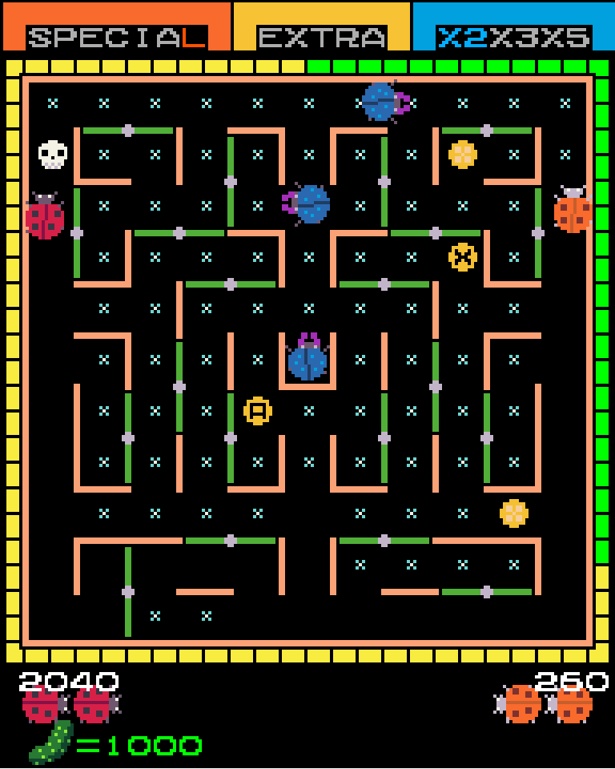

# Lady Beetle LÖVE

<p align="center">
	
</p>

A LÖVE port of the classic Arcade game [Ladybug](https://en.wikipedia.org/wiki/Lady_Bug_(video_game)).

## How to run

Download and install [LÖVE 11.4](https://love2d.org). Clone this repository and run the `love` binary from the root directory:

```
git clone https://github.com/muellerberndt/ladybug-love2d
cd ladybug-love2d
love .
```

## Acknowledgements

- Credits go to [Cosimo](https://github.com/cosimo) for his earlier work on a Love2D port, I re-used some of his assets.
- The game music track is [28th Street Timezone](https://opengameart.org/content/28th-street-timezone) by Locomule (License: CC0)
- [KIRB32 palette](https://lospec.com/palette-list/kirb32) used for new artwork
- Ghost modified from [Upward Floating Soul](https://opengameart.org/content/upwards-floating-soul) by patvanmackelberg (License: CC0)
- Some fruit modified from [CC0 Food Icons](https://opengameart.org/content/cc0-food-icons) (License: CC0)
